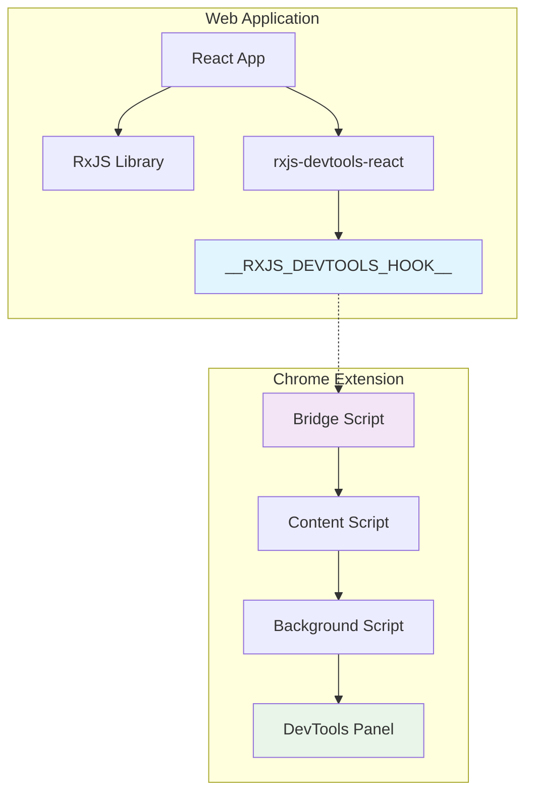
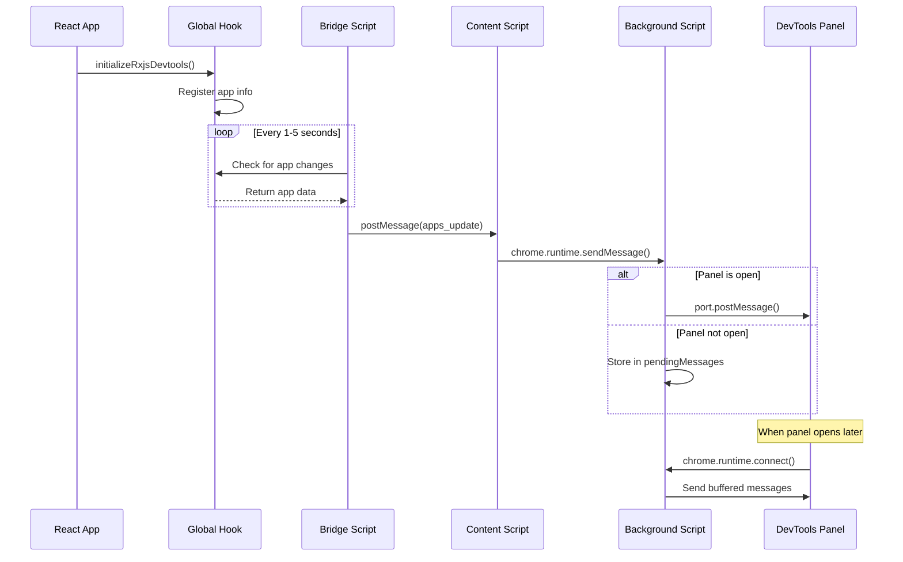

# RxJS DevTools - Architecture Guide

A comprehensive developer tools suite for debugging and inspecting RxJS usage in web applications, consisting of a Chrome extension and React integration package.

## 🏗️ Architecture Overview

The RxJS DevTools consists of two main packages that work together to provide a seamless debugging experience:

1. **`@reefmix/rxjs-devtools-chrome-extension`** - Chrome extension that provides the DevTools panel interface
2. **`@reefmix/rxjs-devtools-react`** - React package that applications integrate to expose RxJS data



## 🧩 Chrome Extension Architecture

The Chrome extension follows Chrome's standard architecture with multiple script contexts that communicate through message passing.

### Components Overview

| Component | Context | Purpose |
|-----------|---------|---------|
| **Bridge Script** | Main World | Accesses page's JavaScript context and window objects |
| **Content Script** | Isolated World | Bridges communication between page and extension |
| **Background Script** | Service Worker | Central message router and state manager |
| **DevTools Panel** | DevTools Context | UI interface within Chrome DevTools |

### 1. Bridge Script (`bridge.js`)

**Context**: Main World (same as the web application)  
**Access**: Full access to `window` object and application globals

```javascript
// Key functionality:
- Polls for window.__RXJS_DEVTOOLS_HOOK__.apps changes
- Detects when apps register themselves
- Posts messages to content script via window.postMessage()
```

**Responsibilities**:
- Monitor the global `__RXJS_DEVTOOLS_HOOK__` for app registrations
- Detect changes in app state (connection status, detected libraries)
- Send app updates to the content script using `window.postMessage()`

**Polling Strategy**:
- Aggressive polling (1s intervals) for first 30 seconds
- Switches to slow polling (5s intervals) after apps are detected
- Stops polling if no apps found after initial period

### 2. Content Script (`content.ts`)

**Context**: Isolated World (secure, limited access)  
**Access**: Can communicate with both page and extension

```typescript
// Message flow:
window.addEventListener('message') // From bridge
  ↓
chrome.runtime.sendMessage() // To background
```

**Responsibilities**:
- Inject the bridge script into the page's main world
- Listen for messages from bridge script
- Forward app data to background script
- Handle Chrome extension API communication

**Security**: Operates in isolated context, cannot access page variables directly.

### 3. Background Script (`background.ts`)

**Context**: Service Worker  
**Access**: Chrome APIs, persistent state management

```typescript
// Central message router:
chrome.runtime.onMessage.addListener() // From content script
chrome.runtime.onConnect.addListener() // From devtools panel
```

**Responsibilities**:
- Route messages between content scripts and devtools panels
- Maintain connections to active devtools panels
- Buffer messages for panels that aren't open yet
- Clean up resources when tabs close

**State Management**:
- `devtoolsConnections`: Active panel connections by tab ID
- `pendingMessages`: Buffered messages for tabs without open panels
- Message queuing with 10-message limit per tab

### 4. DevTools Panel (`panel.tsx`)

**Context**: Chrome DevTools  
**Access**: Chrome DevTools APIs, isolated from page

```typescript
// Connection establishment:
chrome.runtime.connect({ name: 'rxjs-devtools-panel' })
  ↓
port.onMessage.addListener() // Receive app data
```

**Responsibilities**:
- Render the DevTools UI interface
- Display detected apps and their connection status
- Show RxJS and Redux-Observable detection results
- Provide debugging information and message logs

## 📱 React Package Integration

The `@reefmix/rxjs-devtools-react` package provides the application-side integration.

### How Applications Connect

```typescript
// 1. Application imports and initializes
import { initializeRxjsDevtools } from '@reefmix/rxjs-devtools-react';

// 2. Initialize with app configuration
initializeRxjsDevtools({
  appName: 'My React App',
  forceDetection: {
    rxjs: true,
    reduxObservable: true
  }
});
```

### Global Hook Mechanism

The package creates a global hook that the Chrome extension can detect:

```typescript
// Created on window object:
window.__RXJS_DEVTOOLS_HOOK__ = {
  apps: [
    {
      appName: 'My React App',
      connected: true,
      detected: {
        rxjs: true,
        reduxObservable: true
      }
    }
  ],
  registerApp(appInfo) { /* ... */ }
}
```

### Library Detection Strategies

The React package employs multiple detection strategies for RxJS and Redux-Observable:

**RxJS Detection**:
- Check for `window.rxjs`, `window.__RX_JS_PRESENT__`
- Look for common RxJS classes (`Observable`, `Subject`)
- Scan for RxJS-related script tags
- Dynamic import resolution attempts

**Redux-Observable Detection**:
- Check for `window.__REDUX_OBSERVABLE_PRESENT__`
- Look for `combineEpics`, `createEpicMiddleware`
- Scan for redux-observable script references
- Check for epic middleware patterns

## 🔄 Message Flow Architecture

### Complete Message Journey



### Message Types and Structure

**1. App Registration (React → Hook)**
```typescript
{
  appName: string,
  connected: boolean,
  detected: {
    rxjs: boolean,
    reduxObservable: boolean
  }
}
```

**2. Bridge → Content Script**
```typescript
{
  source: 'rxjs-devtools-bridge',
  type: 'APPS_UPDATE',
  apps: AppInfo[]
}
```

**3. Content Script → Background**
```typescript
{
  source: 'rxjs-devtools-content',
  type: 'APPS_UPDATE',
  apps: AppInfo[],
  messageId: number,
  timestamp: number
}
```

**4. Background → DevTools Panel**
```typescript
{
  source: 'rxjs-devtools-content',
  type: 'APPS_UPDATE',
  apps: AppInfo[]
}
```

## 🔧 Technical Implementation Details

### Security Considerations

- **Content Script Isolation**: Cannot directly access page variables
- **Bridge Script Injection**: Safely injects into main world context
- **Message Validation**: All messages include source identification
- **Permission Model**: Minimal required permissions (`storage`, `tabs`, `scripting`, `activeTab`)

### Performance Optimizations

- **Polling Strategy**: Reduces frequency after initial detection
- **Message Buffering**: Prevents loss of data when DevTools closed
- **Connection Management**: Automatic cleanup on tab closure
- **State Diffing**: Only sends updates when app state changes

### Cross-Context Communication

The architecture handles Chrome's security model where different script contexts cannot directly communicate:

1. **Main World ↔ Isolated World**: `window.postMessage()` / `window.addEventListener()`
2. **Isolated World ↔ Extension**: `chrome.runtime.sendMessage()` / `chrome.runtime.onMessage`
3. **Background ↔ DevTools**: `chrome.runtime.connect()` / `port.postMessage()`

### Error Handling and Resilience

- **Connection Recovery**: Automatic reconnection on context invalidation
- **Message Timeouts**: 5-second timeout detection for hanging messages
- **Graceful Degradation**: Continues operation even if some components fail
- **Debug Logging**: Comprehensive logging for troubleshooting

## 🚀 Getting Started

### For Application Developers

```bash
npm install @reefmix/rxjs-devtools-react
```

```typescript
import { initializeRxjsDevtools } from '@reefmix/rxjs-devtools-react';

// Initialize in your app's entry point
initializeRxjsDevtools({
  appName: 'My Application'
});
```

### For Extension Users

1. Install the Chrome extension from the Chrome Web Store
2. Open Chrome DevTools (F12)
3. Navigate to the "RxJS" tab
4. Your connected applications will appear automatically

## 🤝 Contributing

Contributions are welcome! This is a complex architecture with multiple moving parts, so please:

1. Read this architecture guide thoroughly
2. Test across different contexts (main world, isolated world, extension)
3. Follow the existing message passing patterns
4. Add appropriate logging for debugging

---

**Project Status**: Under active development  
**Author**: © Matias Mateu 